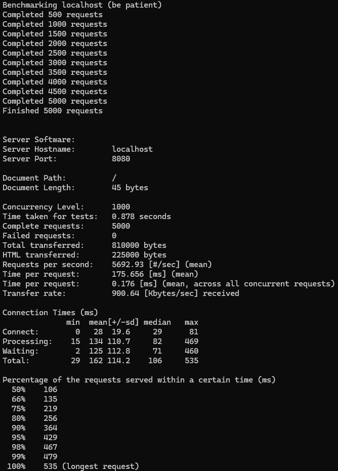

# Go-HTTP-Balancer

1. Самая интересная задача в программировании, которую мнн приходилось решать:
 Одним из моих первых серьезных приложений, был умный калькулятор на C,
в котором мне было необходимо использовать фреймворк QT. Сложность была в том, что мне необходимо было писать логику на С,
тогда как QT работает на C++.
2. На одном учебном проекте я случайно удалил таблицы в базе данных продакшен-окружения, думая, что работаю в тестовом. Бэкапа не было. Я сразу признал ошибку, восстановил схему и вручную внес критичные данные из логов. После этого настроил отдельные конфиги для каждого окружения и автоматическое резервное копирование.
3. От буткемпа ожидаю получить коммерческий опыт, и актуальные знания по Go, и бэкенд технологиям

## Сборка и запуск
Собрать проект, используя ```go build main.go```

прописать необходимые адреса в конфиге ```config.json```

запустить, командой ```./main```

Можно запустить тестовый сервер, командой ```PORT=9001 go run backend.go```


результат бенчмарка

